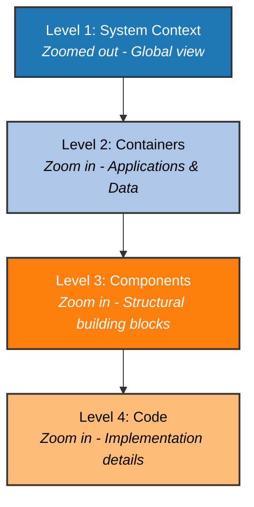
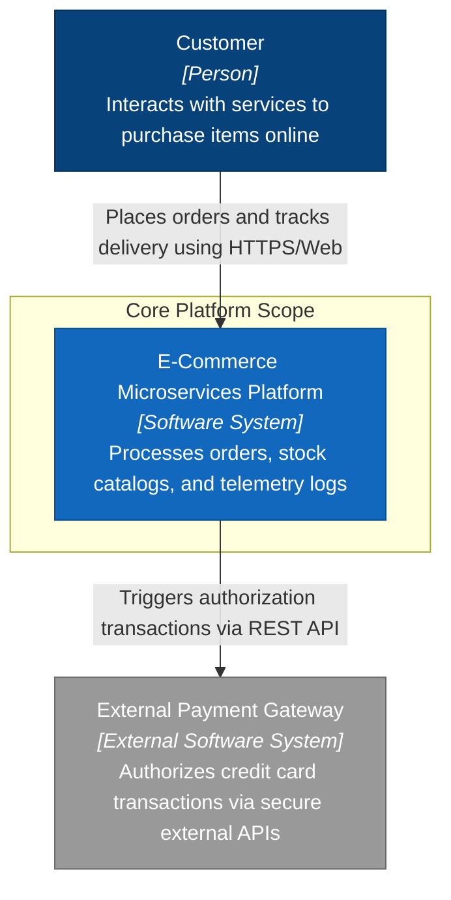
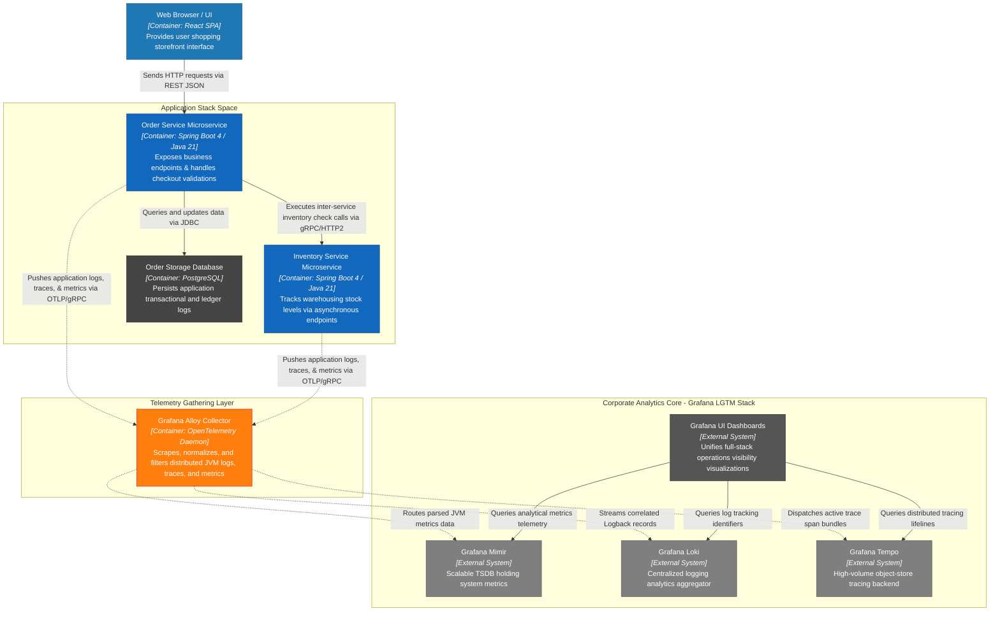

# Software Architecture Blueprint: Introduction to C4 Model

Welcome to the technical architecture guide. This page provides a definitive introduction to the **C4 Model** optimized for **Java Solution Architects**. Use this standard as a blueprint for documenting system hierarchies, container structures, and component abstractions across our enterprise repositories.

---

## 🗺️ What is the C4 Model?

For Java Solution Architects, the **C4 model** is a lightweight, developer-friendly framework that replaces confusing, over-complicated software architecture diagrams with a simple system of **hierarchical abstractions**.

Think of it exactly like **Google Maps**: instead of trying to show every single street, building, and person on a single map, you zoom in and out through **four distinct levels of detail (Context, Containers, Components, and Code)**.



---

## 🔍 The 4 Levels of the C4 Model

### 🌍 Level 1: System Context
*   **What it is:** The highest-level overview showing how your software system fits into the broader world.
*   **What it includes:** Your core system, the specific types of **users** interacting with it, and any critical **external system dependencies** (e.g., third-party payment gateways, CRM integrations).
*   **Target Audience:** Non-technical stakeholders, business owners, product managers, and new team members.
*   **Architect's Goal:** Define scope, boundaries, and high-level value flow.

### 📦 Level 2: Container Diagram
*   **What it is:** A high-level technical map showing the runtime architecture of your system. *(Note: A "container" here means a deployable unit—like a Spring Boot web app, a mobile client, a database, or a serverless function—**not** strictly a Docker container).*
*   **What it includes:** Major applications, databases, microservices, file systems, and the **protocols used for communication** between them (e.g., HTTPS, gRPC, AMQP).
*   **Target Audience:** Enterprise architects, developers, DevOps engineers, and security teams.
*   **Java Architect's Focus:** Map out your Spring Boot microservices, Jakarta EE deployments, Quarkus/Helidon edge services, and data layers (PostgreSQL, Kafka streams, Redis caches).
*   **Architect's Goal:** Define technology choices, high-level data flows, and network boundaries.

### 🧩 Level 3: Component Diagram
*   **What it is:** A view inside an individual container to show its structural layout.
*   **What it includes:** Interfaces, internal controllers, shared services, repositories, and specific architectural layers within a microservice or app.
*   **Java Architect's Focus:** Visualise how your Spring application context is layered (e.g., `@RestController` driving `@Service` classes, communicating via `@Repository` interfaces to the storage tier).
*   **Target Audience:** Software developers and technical leads.
*   **Architect's Goal:** Provide a blueprint for how a specific application layer should be modularized and structured.

### 💻 Level 4: Code Diagram (Optional)
*   **What it is:** An ultra-granular look at the actual code classes, interfaces, or database schemas.
*   **What it includes:** Class diagrams or Entity-Relationship Diagrams (ERDs).
*   **Target Audience:** Developers writing the code on a daily basis.
*   **Architect's Goal:** Keep this automated or completely skipped. Avoid drawing this manually as it goes out of date instantly. Let tools like IntelliJ's internal UML visualizer auto-generate this on demand.

---

## 📑 Core Rules for Architects Using C4
1.  **Every diagram must have a Legend:** There is no official strict color scheme in C4. You can use whatever colors you want, but you *must* provide a key explaining what they mean.
2.  **Explicitly label every line:** Never draw an arrow without a descriptive label. Instead of a blank line, write `Sends email alerts via SMTP` or `Fetches token via HTTPS/REST`.
3.  **No acronyms without context:** Ensure every box explicitly states what technology it uses (e.g., `Spring Boot Microservice`, `PostgreSQL Database`, `React SPA`).

---

## 🛠️ Ready-to-Use Template (Level 1: System Context Diagram)

You can copy and paste the Markdown block below straight into any repository `README.md`. When viewed using IntelliJ IDEA (with the **Mermaid Visualizer** plugin installed) or on GitHub, it will instantly render a standard C4-styled Context diagram:

```markdown
```mermaid
graph TB
    %% Users
    Customer[Customer<br/><i>[Person]</i><br/>Wants to purchase items online]

    %% Internal Systems
    EComSystem[E-Commerce Platform<br/><i>[Software System]</i><br/>Allows users to browse products and place orders]

    %% External Systems
    PaymentGateway[Payment Processor<br/><i>[External Software System]</i><br/>Handles credit card authorizations]
    Fulfillment[Warehouse System<br/><i>[External Software System]</i><br/>Manages inventory and shipping logs]

    %% Relationships
    Customer -->|Browses items & checks out using HTTPS| EComSystem
    EComSystem -->|Authorizes transactions via REST API| PaymentGateway
    EComSystem -->|Sends shipping requests via gRPC| Fulfillment

    %% Styling to mimic C4 standard palette
    style Customer fill:#08427b,stroke:#052e56,color:#fff
    style EComSystem fill:#1168bd,stroke:#0b4c8c,color:#fff
    style PaymentGateway fill:#999999,stroke:#666666,color:#fff
    style Fulfillment fill:#999999,stroke:#666666,color:#fff
```
\`\`\`


# 🏛️ Enterprise C4 Architecture Blueprint: Java Solution Architects
## System Reference Manual: Cloud-Native Microservices & Distributed Telemetry

This documentation serves as a standard reference layout for Solution Architects and Technical Leads. It implements the **C4 Model abstraction framework** to visualize an enterprise cloud-native system built on top of **Spring Boot 4**, incorporating full **OpenTelemetry (OTel)** tracing/metrics pipelines, and streaming telemetry live through **Grafana Alloy** edge collectors to an LGTM analytics stack.

---

## 🌍 The 4 Layers of the C4 Model

Instead of trying to capture business intent, network layers, and software design within a single messy drawing, C4 abstracts architecture down into a structured grid of cascading detail:


### 1. System Context Diagram (Level 1)
*   **Architect's Goal:** Define system boundaries, active user personas, and high-level enterprise external system interactions.
*   **Target Audience:** Non-technical business owners, product lines, and domain stakeholders.

### 2. Container Diagram (Level 2)
*   **Architect's Goal:** Define technology choices (e.g., Spring Boot 4, PostgreSQL), internal communication protocols (e.g., OTLP/gRPC, HTTPS), and data deployment surfaces. Note that a "Container" represents any separately deployable runtime unit, not just a Docker container.
*   **Target Audience:** Enterprise architects, engineering leads, DevOps, and corporate security teams.

### 3. Component Diagram (Level 3)
*   **Architect's Goal:** Deconstruct an individual application container down into its logical modules, controllers, shared business beans, and interface repositories.
*   **Target Audience:** Feature developers and code reviewers.

### 4. Code Diagram (Level 4 - Optional)
*   **Architect's Goal:** Map internal classes, JSpecify annotations, and inheritance graphs. This layer is typically skipped or auto-generated by the IDE, as manual diagrams go out of date immediately when code merges.

---

## 📡 Spring Boot 4 & Grafana Alloy Observability Standards

This architecture relies on **Spring Boot 4's native modularized observability** engine:
*   **`spring-boot-starter-opentelemetry`**: Replaces manual instrumentation wrappers with built-in, out-of-the-box support for the OpenTelemetry API and automatic log-trace correlation.
*   **Unified Protocol (OTLP)**: Data is pushed directly out of the JVM using the standard OpenTelemetry Protocol over high-throughput **gRPC/HTTP** channels.
*   **Grafana Alloy**: Acts as a lightweight local daemon or sidecar collector. It buffers telemetry streams locally, scrapes metrics targets, correlates contextual data, and routes them upstream into your central visualization servers safely without bottlenecking application runtime loops.

---

## 🎨 Interactive C4 Diagrams (Rendered Live)

### C4 Level 1: System Context Map



### C4 Level 2: Technical Container Map (with End-to-End Observability)



---

## 📋 Best Practices & Design Principles for Architects

1.  **Label Every Connector Arrow Explicitly**: Avoid drawing blank arrows. Always state the communication protocol and data payload direction (e.g., `OTLP/gRPC`, `JDBC/TLS`, `HTTPS/REST`).
2.  **Declare Explicit Technology Context**: Write `Spring Boot 4 / Java 21` or `PostgreSQL` directly on the component boxes rather than generic names like "Backend" or "Database".
3.  **Color Code Your Structural Roles Consistently**: Use a simple key layout (e.g., Blue for internal business microservices, Dark Grey for databases, Orange/Red for system observability infrastructure).
4.  **Decouple Applications via Local Telemetry Buffers**: Applications should never stream traces directly to cloud storage backends over the wide Internet. Always route them through an on-premise/local sidecar engine like **Grafana Alloy** to guard your JVM performance limits from unexpected infrastructure drops.
