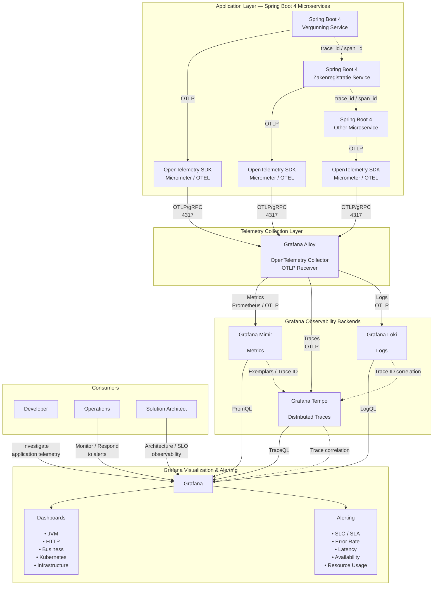

# Spring Boot 4 Microservices — OpenTelemetry / Grafana Observability Architecture



---

## Telemetry flow

The overall flow is:

```text
Spring Boot 4
     │
     │ OpenTelemetry
     │ OTLP
     ▼
Grafana Alloy
     │
     ├──────────────► Mimir
     │                  │
     │                  └── Metrics
     │
     ├──────────────► Tempo
     │                  │
     │                  └── Traces
     │
     └──────────────► Loki
                        │
                        └── Logs

             Mimir ─────┐
             Tempo ─────┼──► Grafana
             Loki ──────┘
                           │
                    ┌──────┴──────┐
                    ▼             ▼
                Dashboards      Alerts
```

## Spring Boot 4 observability responsibilities

Each microservice should expose telemetry through the application instrumentation layer:

```text
Spring Boot 4
     │
     ├── Micrometer
     │      │
     │      └── Metrics
     │
     └── OpenTelemetry
            │
            ├── Traces
            ├── Logs
            └── Metrics
```

For distributed tracing, propagate the trace context between services:

```text
Vergunning Service
        │
        │ HTTP / REST
        │ traceparent
        ▼
Zakenregistratie Service
        │
        │ HTTP / REST
        │ traceparent
        ▼
Other Service
```

This allows Grafana/Tempo to reconstruct the complete distributed transaction.

---

## Grafana's role

Grafana is **not the telemetry collector or primary telemetry store** in this architecture.

Its role is primarily:

```text
                  Grafana
                     │
       ┌─────────────┼─────────────┐
       ▼             ▼             ▼
     Mimir          Tempo         Loki
    Metrics        Traces         Logs
       │             │             │
       └─────────────┼─────────────┘
                     ▼
              Unified View
```

This gives operators a single place to correlate:

**Metrics → Logs → Traces**

For example:

```text
HTTP 500 spike
     │
     ▼
Mimir
     │
     │ investigate time range
     ▼
Grafana
     │
     ▼
Trace
     │
     ▼
Tempo
     │
     │ trace_id
     ▼
Logs
     │
     ▼
Loki
```

---

## Recommended architecture principle

The important separation of responsibilities is:

| Component     | Responsibility                          |
| ------------- | --------------------------------------- |
| Spring Boot   | Generate application telemetry          |
| Micrometer    | Application metrics / observation       |
| OpenTelemetry | Telemetry standard and instrumentation  |
| Grafana Alloy | Collect, process and route telemetry    |
| Mimir         | Long-term metrics backend               |
| Tempo         | Distributed tracing backend             |
| Loki          | Log aggregation backend                 |
| Grafana       | Visualization, correlation and alerting |

This is a good **cloud-native observability architecture** because the application services remain largely independent of the actual observability storage implementation.

For example:

```text
Spring Boot
     │
     │ OTLP
     ▼
   Alloy
     │
     ├── Mimir
     ├── Tempo
     └── Loki
```

The applications therefore don't need to know whether the backend is Grafana, another observability platform, or a future replacement.
