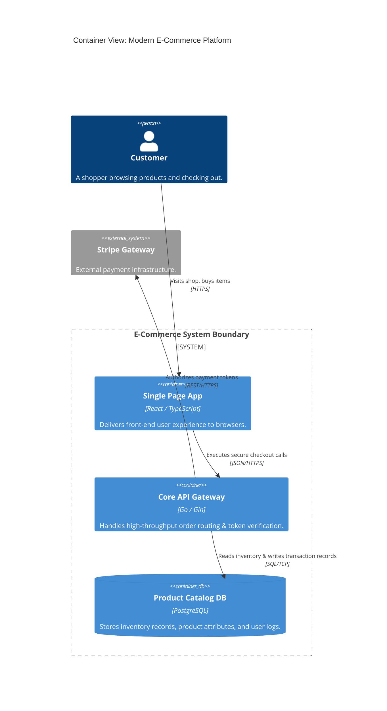
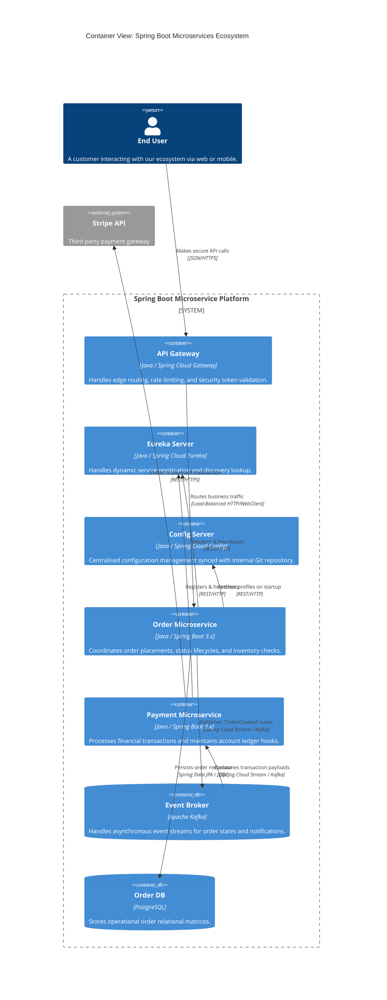
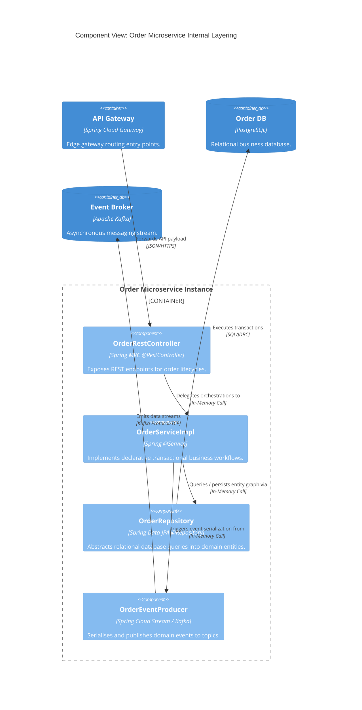
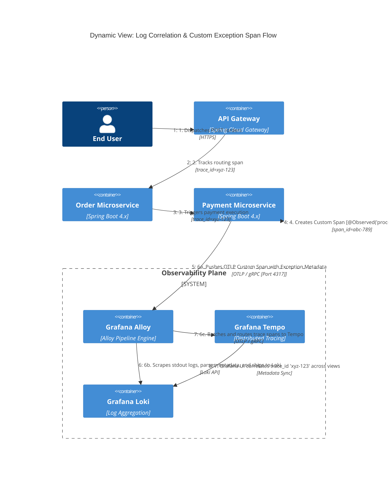

# C4 Model Diagramming with Mermaid

This repository outlines our team's guidelines, syntax rules, and architectural standards for creating **C4 Model Diagrams** using text-based **Mermaid** script.

## 📌 Architectural Philosophy
We use the **C4 Model** to break down software architecture into four distinct levels of abstraction (Context, Containers, Components, and Code). By using **Mermaid**, we store these diagrams directly alongside our code inside `.md` markdown files.

> ⚠️ **Note:** Mermaid's C4 engine is currently an *experimental extension*. Follow these strict styling and macro guidelines to ensure consistent parsing and clean cross-team visuals.

---

## 🏗️ The 4 Core Abstraction Levels

### 1. System Context Diagram (`C4Context`)
Shows the highest level of abstraction. Focuses on external actors (users), system boundaries, and foundational dependencies.
*   **Target Audience:** Product owners, business stakeholders, and onboarding engineers.
*   **Rules:** Do not include technical stacks, database formats, or framework details here.

### 2. Container Diagram (`C4Container`)
Deconstructs a single system into its independently deployable shapes (e.g., frontend apps, microservices, databases, API gateways).
*   **Target Audience:** Core development team and DevOps/SRE engineers.
*   **Rules:** Always state the primary underlying technology (e.g., *Node.js*, *PostgreSQL*).

### 3. Component Diagram (`C4Component`)
Drills into a single Container to map out internal logical structural components (e.g., auth handlers, event publishers, payment controllers).
*   **Target Audience:** Feature developers and software architects.
*   **Rules:** Avoid mapping every class or function. Group them into cohesive functional modules.

### 4. Dynamic/Deployment Diagrams (`C4Dynamic` / `C4Deployment`)
Maps how messages interact over time during an operational flow or visualizes physical infrastructure topology.

---

## 🛠️ Core Syntax Reference & Best Practices

All elements follow a macro format containing specific parameter attributes inside parentheses:
`Element_Type(alias, "Visual Label", "Description", "Technology/Stack")`

### Element Vocabulary Matrix
*   `Person(alias, ...)` – For direct human operators or end-users.
*   `Person_Ext(alias, ...)` – For external human operators (e.g., Third-party auditors).
*   `System(alias, ...)` – Internal software applications owned by our org.
*   `System_Ext(alias, ...)` – Third-party dependencies (e.g., Stripe, SendGrid).
*   `Container(alias, ...)` – Single app boundary or microservice.
*   `ContainerDb(alias, ...)` – Relational, NoSQL, or key-value data storage.

### Defining Relationships
Connections must clarify the context of the link using explicit protocols.
*   **Standard Relation:** `Rel(from, to, "Does action", "Protocol")`
*   **Bi-Directional Relation:** `BiRel(from, to, "Syncs data", "gRPC")`
*   *Example:* `Rel(spa, api, "Makes API calls", "JSON/HTTPS")`

---

## 📝 Canonical Code Template (Level 2: Container Diagram)

Copy and adapt this snippet when documenting a standard web application architecture:



---

## ⚙️ Workarounds for Mermaid C4 Limitations

Because Mermaid C4 lacks full positional control modifiers (`Rel_Down`, `Rel_Right`), adhere to these layout rules to prevent rendering messy diagrams:

1.  **Enforce Rows via Configuration:** Use the layout configuration block at the base of your file to force alignment grouping:
    ```mermaid
    UpdateLayoutConfig(\(c4ShapeInRow="3", \)c4BoundaryInRow="2")
    ```
2.  **Order of Declaration Matters:** Mermaid renders elements in the chronological sequence they are declared in the markup. Define your top-level Actors **first**, your core Gateways **second**, and external targets **last**.
3.  **Boundary Wrapping:** Always group coupled microservices inside a matching `System_Boundary` or `Container_Boundary` tag to generate a clean distinct boundary wall.

---

## 🚀 How to Render This Page Properly

*   **GitHub/GitLab UI:** Renders automatically inside Markdown files.
*   **VS Code Integration:** Install the **Markdown Preview Mermaid Support** extension to view updates in real-time.
*   **GitHub Pages / Static Sites:** Ensure your site build configuration imports the `mermaid.js` global CDN bundle, as default Jekyll processing scripts block text code syntax elements.

---

# C4 Model Diagramming with Mermaid (Spring Boot Microservices)

This repository outlines our team's guidelines, syntax rules, and architectural standards for documenting our **Spring Boot / Spring Cloud microservices** using text-based **Mermaid** script.

## 📌 Architectural Philosophy
We use the **C4 Model** to map out our distributed system. By embedding **Mermaid** diagrams directly inside our Markdown files, our architecture documentation lives alongside our Java code and evolves with our pull requests.

> ⚠️ **Note:** Mermaid's C4 engine is an *experimental extension*. Follow these strict structural and layout guidelines to keep our large-scale distributed topology readable and cleanly aligned.

---

## 🏗️ Spring Boot Infrastructure Standards

To maintain consistency across all service diagrams, always use the following naming and technology definitions:

| Layer / Element | Mermaid Macro | Technology Parameter |
| :--- | :--- | :--- |
| **API Gateway** | `Container(gateway, ...)` | `"Java / Spring Cloud Gateway"` |
| **Discovery Server** | `Container(eureka, ...)` | `"Java / Spring Cloud Netflix Eureka"` |
| **Config Server** | `Container(config, ...)` | `"Java / Spring Cloud Config Server"` |
| **Microservice** | `Container(svc, ...)` | `"Java / Spring Boot 3.x"` |
| **Message Broker** | `ContainerDb(broker, ...)` | `"Apache Kafka" or "RabbitMQ"` |
| **Database** | `ContainerDb(db, ...)` | `"PostgreSQL" / "MongoDB" / "Redis"` |

---

## 📝 Level 2: Container Diagram (System Topology)

Use this baseline template to visualize how our Spring Cloud infrastructure orchestrates routing, configuration, discovery, and service-to-service communication.



---

## 📝 Level 3: Component Diagram (Inside a Spring Boot App)

When zooming into a single container (e.g., the `Order Microservice`), map out the internal structural components based on our standard multi-layered architecture (`Controller` ➡️ `Service` ➡️ `Repository`).



---

## ⚙️ Layout Optimisation Guidelines for Spring Architectures

Because microservice fabrics quickly turn into complex "spaghetti" diagrams, adhere strictly to these Mermaid C4 hacks:

1.  **Exploit Directional Macros:** Even though generic Mermaid C4 uses `Rel()`, you can force positioning using `Rel_Up()`, `Rel_Down()`, `Rel_Left()`, and `Rel_Right()`. Use `Rel_Right` or `Rel_Left` to push structural cross-cutting infrastructure nodes (like Eureka or Config Server) out of the vertical functional flow.
2.  **Order of Declaration:** Declare core platform components like the `API Gateway` at the very top of your script block. Mermaid lays elements out in the order it finds them.
3.  **Boundary Isolation:** Keep databases, cache stores, and event hubs inside the matching `System_Boundary` tag only if they are dedicated to those specific service scopes. For shared event brokers (like an enterprise Kafka mesh), declare them outside the microservice boundary block.


---

## 📝 Level 4: Dynamic Trace Context Flow (Spring Boot 4 OTEL + Grafana Alloy)

This dynamic view outlines the transactional workflow of a single distributed request, demonstrating how trace context (`traceparent` header) propagates through our Spring Boot 4 stack, offloads to a **Grafana Alloy** collector instance via OTLP/gRPC, and visualizes within the Grafana LGTM stack (Tempo).

### Architecture Stack Rules (Observability)
*   **Application Instrumentation:** Native compiled compilation using `spring-boot-starter-opentelemetry`. **No Java Agents allowed**.
*   **Context Propagation:** Strict adherence to the `W3C Trace Context` specification.
*   **Collector Daemon:** Centralized infrastructure processing using `Grafana Alloy` scraping endpoints and pipelines.


---

## ⚙️ Spring Boot 4 + Grafana Alloy Integration Standards

To ensure traces match perfectly along the dynamic visual stream above, all microservices must implement identical naming schemas and protocols.

### 1. Spring Boot 4 Application Properties (`application.yml`)
Spring Boot 4 introduces vendor-neutral telemetry definitions. The following variables match the configurations mapped out in the visual elements above:

```yaml
spring:
  application:
    name: order-service

management:
  otlp:
    tracing:
      endpoint: http://internal.net # Points directly to Alloy daemon mapping
  tracing:
    sampling:
      probability: 1.0 # 100% of telemetry data explicitly captured for this pipeline
```

### 2. Grafana Alloy Configuration Block (`config.alloy`)
Our architecture replaces the legacy OpenTelemetry Collector with **Grafana Alloy**. Configure the component block pipeline inside Alloy to intercept and send data directly into Grafana Tempo as shown in step 6:

```alloy
// Listens on native gRPC protocol ports matching Step 5 definitions
otelcol.receiver.otlp "default" {
  grpc {
    endpoint = "0.0.0.0:4317"
  }
}

// Batches and sanitizes spans to optimize network requests
otelcol.processor.batch "default" {
  output {
    metrics = [otelcol.exporter.otlp.tempo.input]
    traces  = [otelcol.exporter.otlp.tempo.input]
  }
}

// Exports processed traces into Tempo
otelcol.exporter.otlp "tempo" {
  client {
    endpoint = "tempo.internal.net:4317"
    tls { inversion_insensitive = true }
  }
}
```


---

## 📝 Level 4 Extended: Log Correlation (Loki) & Custom Exception Spans

This section details how our Spring Boot 4 microservices link application log lines directly to trace spans (**Loki + Tempo cross-linking**) and how to create custom inline telemetry spans to track critical business logic or failures (e.g., payment rejections).

### Architecture Stack Rules (Logs & Custom Tracing)
*   **Log Appenders:** Use the `OpenTelemetryAppender` to automatically inject `trace_id` and `span_id` properties directly into our application logs.
*   **Log Shippement:** Grafana Alloy scrapes container stdout logs and parses them into **Grafana Loki**.
*   **Custom Instrumentation:** Use Spring's native `@Observed` annotation or the OpenTelemetry API directly to capture domain-specific trace spans.



---

## ⚙️ Spring Boot 4 Code Standards for Loki & Custom Spans

### 1. Unified Logging Configuration (`logback-spring.xml`)
To ensure Grafana Alloy can correlate logs with your Tempo traces, configure Spring Boot 4 to include the OpenTelemetry MDC tracking variables:

```xml
<?xml version="1.0" encoding="UTF-8"?>
<configuration>
    <appender name="STDOUT" class="ch.qos.logback.core.ConsoleAppender">
        <encoder>
            <!-- 
              Crucial: The pattern includes [trace_id=%X{trace_id} span_id=%X{span_id}] 
              which Grafana Alloy parses to establish the log-to-trace link.
            -->
            <pattern>%d{yyyy-MM-dd HH:mm:ss.SSS} [%thread] %-5level %logger{36} - [trace_id=%X{trace_id} span_id=%X{span_id}] - %msg%n</pattern>
        </encoder>
    </appender>

    <root level="INFO">
        <appender-ref ref="STDOUT" />
    </root>
</configuration>
```

### 2. Creating Custom Trace Spans & Business Exceptions
Do not let generic framework auto-configuration handle deep business processes. Use the standard OpenTelemetry API directly within your Spring Boot 4 `@Service` classes to isolate key operational code blocks:

```java
package com.example.payment.service;

import io.opentelemetry.api.trace.Span;
import io.opentelemetry.api.trace.Tracer;
import io.opentelemetry.context.Scope;
import org.slf4j.Logger;
import org.slf4j.LoggerFactory;
import org.springframework.stereotype.Service;

@Service
public class PaymentProcessingService {

    private static final Logger log = LoggerFactory.getLogger(PaymentProcessingService.class);
    private final Tracer tracer;

    public PaymentProcessingService(Tracer tracer) {
        this.tracer = tracer;
    }

    public void executeTransaction(String orderId, double amount) {
        // Create a custom named child span under the existing active trace context
        Span customSpan = tracer.spanBuilder("ProcessPaymentTransaction")
                                .setAttribute("order.id", orderId)
                                .setAttribute("payment.amount", amount)
                                .startSpan();

        // Establish scope so logging frameworks automatically capture the custom span_id
        try (Scope scope = customSpan.makeCurrent()) {
            
            log.info("Contacting payment gateway provider endpoint...");
            
            if (amount > 10000.0) {
                // Mimic a custom business structural failure condition
                throw new InsufficientFundsException("Transaction limit exceeded for this profile.");
            }
            
            customSpan.setAttribute("payment.status", "SUCCESS");
            
        } catch (InsufficientFundsException ex) {
            // Log line inherits trace_id and custom span_id automatically
            log.error("Payment failed execution: {}", ex.getMessage());
            
            // Record the exception metadata directly onto the Tempo span timeline
            customSpan.recordException(ex);
            customSpan.setStatus(io.opentelemetry.api.trace.StatusCode.ERROR, ex.getMessage());
            throw ex;
            
        } finally {
            // Close out tracking cleanly
            customSpan.end();
        }
    }
}
```

### 3. Grafana Alloy Pipeline Extension (`config.alloy`)
Update your existing collector deployment to parse standard out logs alongside trace endpoints. This pipeline intercepts incoming container stream blocks, extracts matching regex metadata variables, and delivers clean payloads directly to Loki.

```alloy
// Discover and tail microservice container log trails
discovery.docker "containers" {
  host = "unix:///var/run/docker.sock"
}

local.file_match "app_logs" {
  path_targets = discovery.docker.containers.targets
}

// Intercept and extract trace_id from log structures using regex
loki.process "log_correlation" {
  forward_to = [loki.write.grafana_loki.receiver]

  stage.regex {
    expression = ".*trace_id=(?P<trace_id>[a-f0-9]*) span_id=(?P<span_id>[a-f0-9]*).*"
  }

  // Inject parsed values as structural indexed labels
  stage.labels {
    values = {
      trace_id = null,
      span_id  = null,
    }
  }
}

loki.write "grafana_loki" {
  endpoint {
    url = "http://internal.net"
  }
}
```
