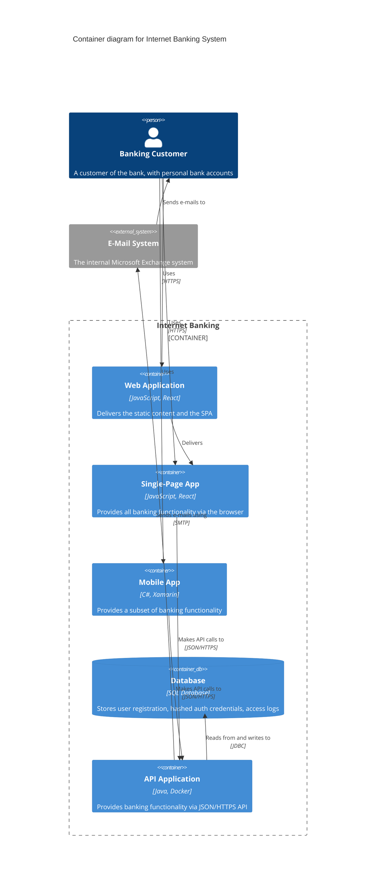
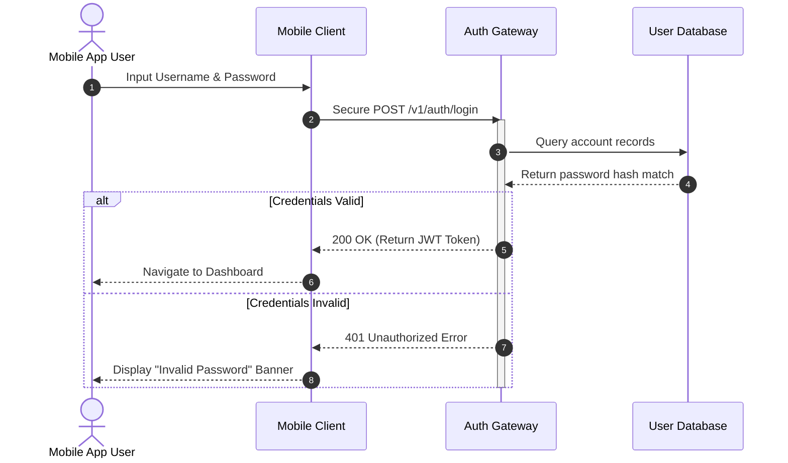

# Project Authentication Service

This repository manages the microservice responsible for handling user secure sessions. Below is the system interaction blueprint for the primary login flow.

## User Authentication Sequence

When a user attempts to log into the application, the mobile client verifies credentials securely against our centralized auth gateway using the following chronological lifecycle:





## How to Edit This Diagram
If you are using **IntelliJ IDEA** with the **Mermaid Visualizer** plugin installed:
1. Open this `../README.md` file.
2. Click the **Split View** (Editor and Preview) button in the top-right corner of the IDE.
3. Modify the plain-text lines inside the ` ```mermaid ` code fence. The graphical sequence chart will update instantly on your screen.
