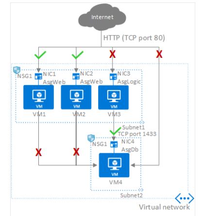
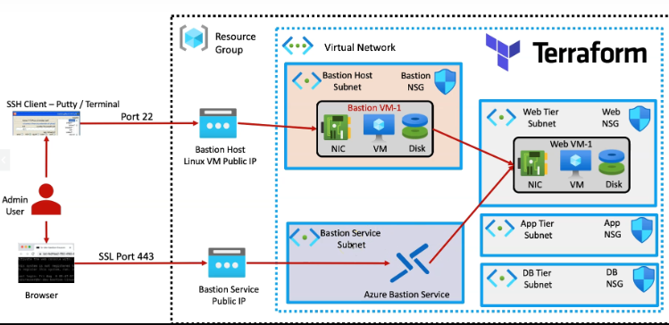

# AZ VM's, Virtual Networks, Subnets

## Traditional non Bastion setup

## Application Security Groups / Network Security Groups NSG
Application security groups enable you to configure network security as a natural extension of an application's structure, allowing you to group virtual machines and define network security policies based on those groups.

### Allow-HTTP-Inbound-Internet
This rule is needed to allow traffic from the internet to the web servers. Because inbound traffic from the internet is denied by the DenyAllInbound default security rule, no extra rule is needed for the AsgLogic or AsgDb application security groups.

Priority	Source	Source ports	Destination	Destination ports	Protocol	Access
100	Internet	*	AsgWeb	80	TCP	Allow

### Deny-Database-All
Because the AllowVNetInBound default security rule allows all communication between resources in the same virtual network, this rule is needed to deny traffic from all resources.

Priority	Source	Source ports	Destination	Destination ports	Protocol	Access
120	*	*	AsgDb	1433	Any	Deny
- R - 5301
- P - 6393
- T - 8226
- C - 6233

### Allow-Database-BusinessLogic
This rule allows traffic from the AsgLogic application security group to the AsgDb application security group. The priority for this rule is higher than the priority for the Deny-Database-All rule. As a result, this rule is processed before the Deny-Database-All rule, so traffic from the AsgLogic application security group is allowed, whereas all other traffic is blocked.

Priority	Source	Source ports	Destination	Destination ports	Protocol	Access
110	AsgLogic	*	AsgDb	1433	TCP	Allow

In the previous picture, NIC1 and NIC2 are members of the AsgWeb application security group. NIC3 is a member of the AsgLogic application security group. NIC4 is a member of the AsgDb application security group. Though each network interface (NIC) in this example is a member of only one application security group, a network interface can be a member of multiple application security groups, up to the Azure limits. None of the network interfaces have an associated network security group. NSG1 is associated to both subnets and contains the following rules:

## Bastion Host vs Azure Bastion Service

### Azure Bastion Service
Azure Bastion eliminates the need to set up VPNs, jump servers, or additional security layers by providing a managed, browser-based RDP and SSH connection over SSL. It enables administrators to manage their VMs without needing a public IP address, making the network more secure and less vulnerable to threats. This approach simplifies secure access while maintaining a robust security posture.

### Bastion Host
Setting up a Bastion Host follows a traditional approach where a dedicated virtual machine is deployed in an isolated subnet, separate from the main workload VMs. This Bastion Host has a public IP exposed to the user, enabling secure access to this isolated VM. From the Bastion Host, the user can then connect to the internal workload VMs, ensuring secure connectivity. Once the Bastion Host is configured, the public IP of the main resources is removed, minimizing exposure to the public internet while maintaining secure, internal access to the VMs.

