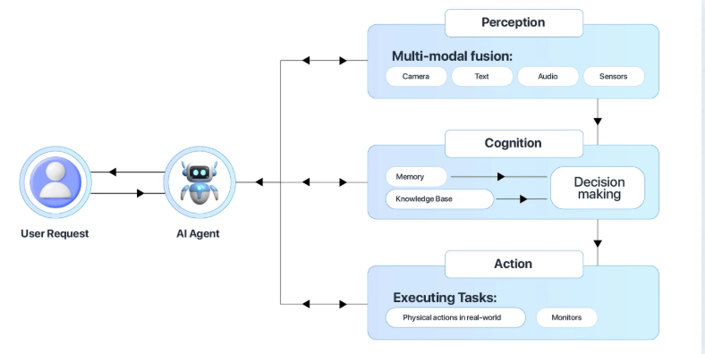

# What is agentic AI (from Chatting to Doing)

### About Agentic AI
Agentic AI also referred as to AI Agents are the next frontier of Artificial Intelligence.
- Makes autonomous decisions and perform actions to achieve an objective without constant human supervision.
- **Tool Calling**
  - Ability real-time connect to data sources, software systems, or even other AI agents to get the necessary content on top of what it was trained and learned.
  - Calling external interfaces to do things; creating OMS orders, inserting inventory records, adapting workflows, generating documents, sending out notifications, and so on... 
- **Memory** 
  - Ability to store and retrieve data from past interactions
  - Learn and adapt: improve performance over time through experience
- Differs from AI assistens (ChatGPT) having limited autonomy in assisting users, limited to the back-and-forth conversational model.
- Differs from AI copilots having some autonomy but working alongside users to supporting their decision-making processes.
- Capabilities to optimize operations, automate complex processes and enhance customer experiences -> Agentic AI is reshaping the competitive landscape.
- **Economist**: agentic AI in enterprise software applications will grow from less than 1% in 2024 to 33% by 2028, enabling autonomous solutions for 15% of day-to-day work decisions.

### How Does Agentic AI work?
1. **Preceive** : sensing for additional data on top of what it was learned on from various sources, such as proprietary database, digital interfaces, REST API and so on.
2. **Reason** : interacting with LLM as the reasoning engine to understand and come to a conclusion. Taking in the prompt it was provided (constrained to the relevant business logic), alternatively using techniques like RAG (retrieval-augmented generation) to enriching with proprietary data sources and deliver accurate relevant outputs.
3. **Act** : executing tasks by calling external tools, like opening new DB orders on an OMS system (Order Management System). Guardrails to constrain the impact on your systems.
4. **Learn**: Continuously improving through feedback loops (data flywheel) by feeding back data into its system to enhance its model.

### Key Takeaways [reference XENONSTACK](https://www.xenonstack.com/blog/agentic-ai)
- Automate repetitive tasks freeing up human resource to focus on more strategic and creative tasks like innovation.
- It improves customer service, with 54% of companies using agentic AI for faster, personalized responses, boosting satisfaction.
- The global AI market is projected to reach $594 billion by 2032, driven by the widespread adoption of Agentic AI across various industries.
- Its architecture focuses on modularity, scalability, and interoperability for seamless integration with existing technologies.
- Applications include healthcare, finance, and autonomous vehicles, etc...

### References
- [XENONSTACK - Agentic AI Frameworks, Tools and Use Cases](https://www.xenonstack.com/blog/agentic-ai)
- [NVIDIA - Powering the Next Generation of AI Agents](https://www.nvidia.com/en-us/ai/)

