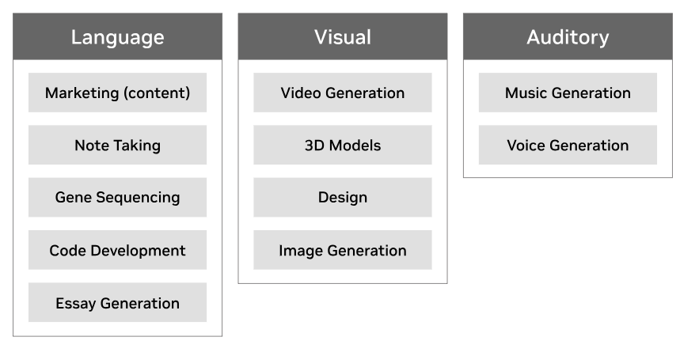

# What is Generative AI

- **Generative** because of its ability to generate content like text, images, music, audio and videos
- Traditional back-and-forth discussion, conversation between human and machine as we know it from ChatGPT
- Relies on LLM's reasoning capabilities, built on LLM
- LLM pre-trained on vast amounts of existing static data.
- Depends on knowledge cut-off date on the data it ingested.
- *Generative AI focuses on creation/generation*

### Generative AI Use Cases

