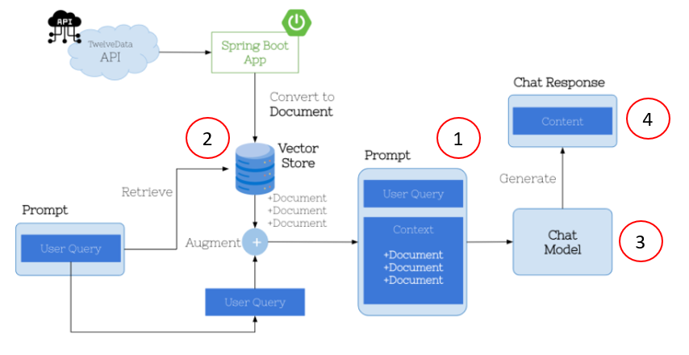

# Observe - Insights into AI-related Components behavior

### Why is Observability important for Spring AI?
- Spring AI's functionality composed out of ridge set of closely integrated Components.
- Allows Developers to capture details on various Application Component behavior under various Conditions like response times on each component invocation.
- Metrics: measurements providing insights about state and performance AI components: Model, VectorStore, prompts...
  - CPU usage, Memory consumption, response times and error rates
- Traces: tracking sequence of Events that occur while handing AI requests across misc Components, check how data flows from one component into another.

## Observability in Spring AI
Spring AI utilizes Micrometer to get a complete view of your application performance and identifying issues across distributed Spring AI components.
Micrometer provides an abstraction for capturing metrics (request counts, CPU usage, response times...) and export it to popular monitoring systems like Prometheus. 
- Spring Framework supports observability through [Micrometer](https://micrometer.io/) for metrics.
- Spring Framework supports observability through [Micrometer Tracing](https://micrometer.io/docs/tracing) for distributed tracing.
- Spring AI provides metrics and tracing functionality for its core components, including ChatClient, Advisors, ChatModel, EmbeddingModel, ImageModel, and VectorStore
- Micrometer is designed to integrate with wide array of monitor systems, such as Prometheus, Azure Metrics, Graphite...
- Visualize collected metrics and traces with tools like Grafana, Kibana, MS Azure Metrics and Log Analytics.
  

1. **Prompt**: Number tokens model input (prompt), full content prompt, temperature setting for the model request, ..
2. **VectorStore**: content search similarity query, metadata filters used in search query, dimension of the vector,..
3. **ChatModel**: number of tokens model input, total number tokens in model exchange, max number of tokens model generates for a request,...
4. **ChatResponse**: # tokens used in model output, full response received from the model,...

## Read more about SpringFramework and Metrics
- [Spring Retrieving metrics](https://docs.spring.io/spring-boot/api/rest/actuator/metrics.html)

