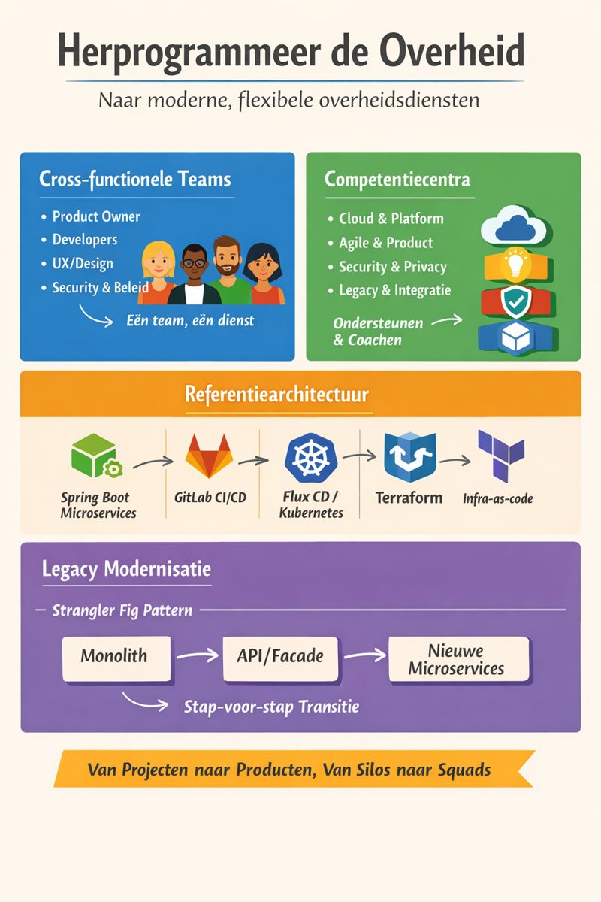

# Herprogrammeren van de Overheid

> Naar moderne, flexibele overheidsdiensten met cross-functionele teams, cloud-native microservices en stapsgewijze legacy-modernisatie.

---

## 1. X-functionele teams (Squads)

Kleine, autonome teams (6–12 personen) rond een **specifieke publieke dienst of capability**.

### Squad Verantwoordelijkheden
- Eigenaarschap over eind-tot-eind services: code → productie → security → observability → reliability
- Continue samenwerking met beleid en burgerfeedback
- Iteraties van 2–3 weken met continue deployment

### Typische Squad Samenstelling
- **Product Owner** – vertegenwoordigt beleid en burgers
- **Software Engineers** (4–6) – full-stack, API’s, DevOps
- **UX / Service Designer** – citizen journeys, toegankelijkheid
- **Test / Quality Engineer** – geautomatiseerd testen, non-functional requirements
- **Embedded Security / Privacy Specialist** – AVG/GDPR compliance
- **Ops / SRE** – reliability, incident response

> Motto: *“Van IT voor beleid naar gezamenlijke verantwoordelijkheid voor dienstverlening”*

---

## 2. Competentiecentra

Lightweight enabling centra, **niet controlerende CoEs**, ondersteunen squads en coachen.

### Voorbeelden
- **Cloud & Platform** – Terraform modules, Kubernetes platform, CI/CD templates, security guardrails
- **Agile & Product** – Product Owner coaching, outcome metrics, product playbooks
- **Security & Privacy** – privacy-by-design, policy-as-code, DPIA templates
- **Legacy & Integratie (tijdelijk)** – begeleiding bij monolith extracties, API-facades, data migratie

> Motto: *“Wij bouwen de weg, jullie rijden erop”*

---

## 3. Referentiearchitectuur

### Applicatie Stack
- Spring Boot 3.x microservices
- Actuator, Micrometer, OpenTelemetry
- Security: OAuth2 / OIDC
- Stateless services, externalized config

### CI/CD
- GitLab pipelines: build → test → security scan → artefact push
- Artefacten: OCI container images, SBOM, Helm/Kustomize charts

```yaml
stages:
  - build
  - test
  - scan
  - package

build:
  stage: build
  script:
    - ./mvnw clean package

container:
  stage: package
  script:
    - docker build -t $CI_REGISTRY_IMAGE:$CI_COMMIT_SHA .
    - docker push $CI_REGISTRY_IMAGE:$CI_COMMIT_SHA

```
## korte visuele infographic / diagram


