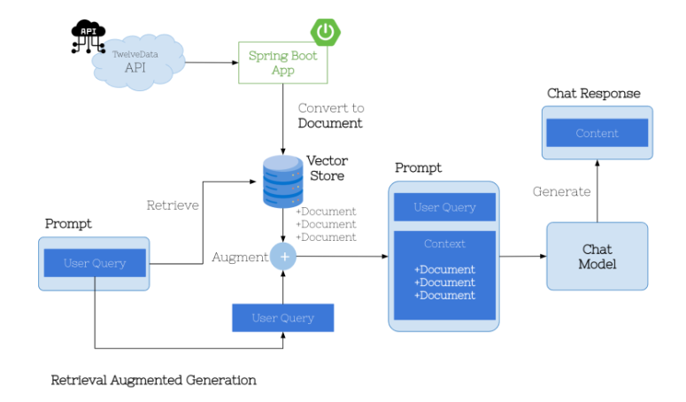

# What is RAG (Retrieval Augmented Generation)

### The limitations of Pre-Trained Models and solution to that problem
- Large language models (LLMs) like ChatGPT are trained on public internet data that was available at the point in time when they were trained (aka Knowledge cut-off date). 
- They can answer questions related to the data they were trained on.
- Everything beyond cut-off could get impacted by AI hallucination.
- Retrieval Augmented Generation (RAG) is a smart way to improve how AI systems answer questions or create content by combining two steps:
  - retrieving useful information and generating responses
  - Instead of just relying on what the AI knows, RAG pulls in extra data that helps the system understand the question better and provide more accurate and context-aware answers. 

## Benefits and Applications of RAG
- Improved privacy: You can use data that the AI wasn’t trained on, meaning you don’t have to worry about the AI knowing sensitive information beforehand.
- Better context: The system can pull in relevant information to understand the user’s question more deeply.
- Higher accuracy: By looking up information, RAG helps reduce mistakes (when AI makes up things) by using real facts.
  

## Content compiled from...
- [Amazon AWS: What is RAG](https://aws.amazon.com/what-is/retrieval-augmented-generation/)
- [NVIDIA: What Is Retrieval-Augmented Generation, aka RAG?](https://blogs.nvidia.com/blog/what-is-retrieval-augmented-generation/)

