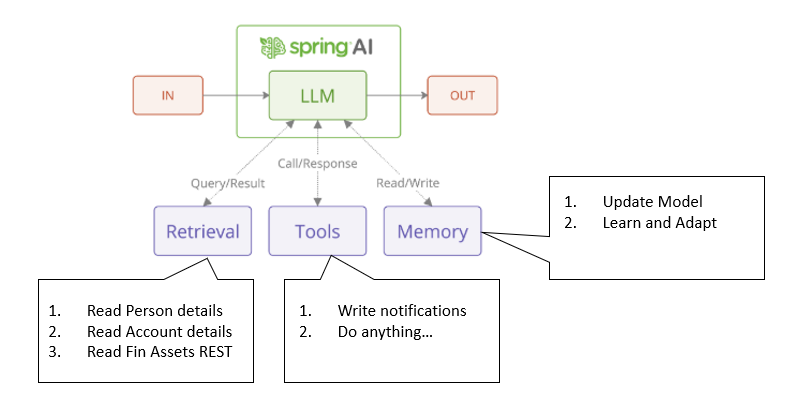

# ShowCase Project demonstrating Agentic AI with MCP

ShowCase project demonstrates the ability of AI Models to interact with external tools or systems to enhancing their functionality by calling tools. 
AI systems with tool-calling capabilities can query databases, fetch real-time information, execute functions to perform complex operations. 
**Tool Calling** is meant to be the key enabler of **Agentic AI**. 

This project demonstrates...
1. providing Tools to query external databases.
2. providing tools to fetch additional real-time stocks, forex and other financial assets over REST API by calling [twelvedata financial data services](https://twelvedata.com/).
3. providing tools to execute functions like sending out notifications over WhatsApp, Mail, Kafka and so on...

## Enhancing AI LLM Models by providing tools with MCP

- Retrieval
    - Read Person details from RDMS through tools provided by **person-mcp-server**.
    - Read Account details for these persons from RDMS through tools provided by **account-mcp-server**
- Call
    - Post notification with the responses returned provided by previous retrieval tool calls
    - Notification sent through tools provided by **notification-msp-server**
- Memory
    - Ability to store and retrieve data from past interactions
    - Learn and adapt: improve its performance over time through experience

